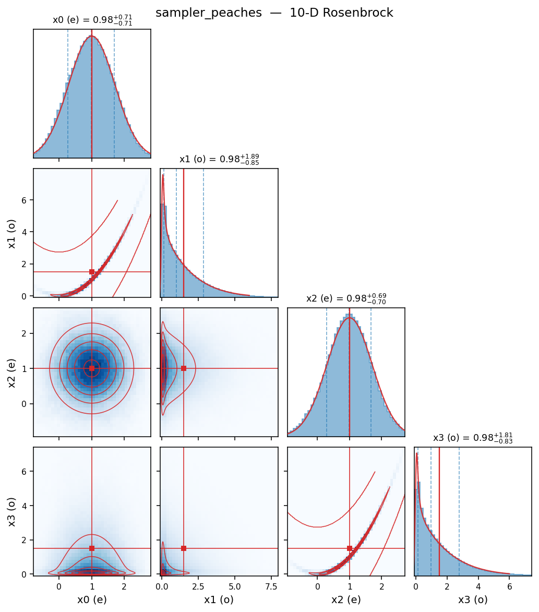
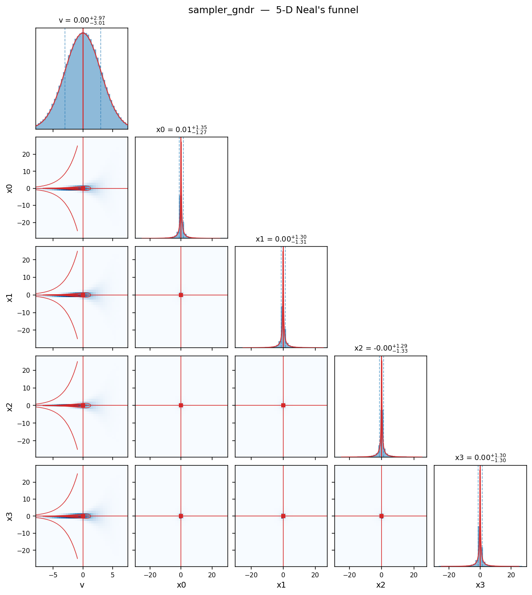

# AffineInvariantSamplers

JAX implementations of affine-invariant ensemble MCMC samplers and related
Hamiltonian Monte Carlo variants.

Paper: [**New affine invariant ensemble samplers and their dimensional
scaling**](https://arxiv.org/abs/2505.02987)

The original numpy implementation that accompanied the paper lives on the
[`initial-samplers`](https://github.com/yifanc96/AffineInvariantSamplers/tree/initial-samplers)
branch.  This `main` branch is a redesigned JAX-based package with a
much larger family of samplers that target high-dimensional distributions,
curved geometry, and heterogeneous / multiscale geometry — with or without
access to gradients of the target.  More papers on analysis and
methodological development are forthcoming.

## Install

```bash
git clone https://github.com/yifanc96/AffineInvariantSamplers.git
cd AffineInvariantSamplers
pip install -e .
```

Requires Python ≥ 3.10, `jax`, `jaxlib`, `numpy`.  For plotting utilities,
add `[plot]`; for tests, add `[test]`.

## Which sampler should I use?

- **Curved geometry** (e.g. Rosenbrock) — start with `sampler_peaches` (affine invariant ChEES-HMC).
  Other strong choices in the same family: `sampler_peanuts` (affine invariant NUTS),
  `sampler_pickles` (affine invariant metropolized kinetic Langevin), `sampler_peams` (affine invariant metropolized microcanonical
  HMC).  All are ensemble affine-invariant versions of well-tuned HMC.
- **Multiscale geometry** (e.g. Neal's funnel) — use a delayed-rejection
  sampler: `sampler_ensemble_dr_stretch` (gradient-free) or
  `sampler_gndr` (gradient + Gauss–Newton preconditioned Langevin).
- **High dimension** — prefer gradient-based ensemble HMC (peaches,
  peanuts, pickles, peams).  If you have no gradient, `sampler_kalman_move`
  achieves Langevin-like scaling on approximately Gaussian targets.

## Quick start

```python
import jax, jax.numpy as jnp
from affine_invariant_samplers import sampler_peaches

# 10-D Rosenbrock  (a = 1, b = 100).  Batched log density (n_chains, D) -> (n_chains,).
a, b = 1.0, 100.0
def log_prob(x):
    xe, xo = x[:, ::2], x[:, 1::2]
    return -(b * jnp.sum((xo - xe ** 2) ** 2, axis=1)
             + jnp.sum((xe - a) ** 2, axis=1))

init = jax.random.normal(jax.random.key(0), (100, 10))   # 100 walkers, D=10
samples, info = sampler_peaches(log_prob, init, num_samples=5000, warmup=1000,
                                 step_size=0.01)
```

**Output** (seed 0, with `affine_invariant_samplers.effective_sample_size`
for the last line):

```
samples.shape  = (5000, 100, 10)                            # 500 000 total samples
info           = {'acceptance_rate': 0.993, 'final_step_size': 0.0118,
                  'nominal_L': 20, 'n_grad_evals': 10_000_000}
x_even moments : mean = 0.99  var = 0.50   (target: 1.00, 0.500)
x_odd  moments : mean = 1.48  var = 2.44   (target: 1.50, 2.505)
min ESS        : 1031                                       # worst-mixing of the 10 coordinates
```

`min_ESS` is the smallest entry of `effective_sample_size(samples)`, i.e.
the **worst-mixing dimension**.  ESS = N<sub>total</sub> / τ where τ is the
integrated autocorrelation time; it tells you how many *independent* draws
would give the same Monte-Carlo variance.  Here ≈ 1 000 of the 500 000
samples' worth of information is realised in the hardest direction (the
long Rosenbrock axis) — that dimension sets the bottleneck for joint
statistics.

<p align="center">
  
</p>

Blue histograms = posterior samples, red curves/contours = exact Rosenbrock
marginals.

### A multiscale target: Neal's funnel with `sampler_gndr`

Neal's funnel mixes a Gaussian latent `v ~ N(0, 9)` with a Gaussian
conditional `x_i | v ~ N(0, exp(v))`: the target variance of each `x_i`
is `E[exp(v)] = e^{9/2} ≈ 90`, and the neck collapses to width ~`e^{v/2}`
which becomes very small at `v ≪ 0`.  Plain MCMC fails here because no
single step size works for both the neck and the mouth.  `sampler_gndr`
handles it via a Gauss–Newton proposal (step size rescaled by a
state-dependent Hessian approximation) plus `n_try`-stage delayed
rejection, where each stage shrinks the step size by a factor `shrink`
(so the successive trial step sizes are `h, shrink·h, shrink²·h, …`).
Here we use `n_try=3` and `shrink=0.3`:

```python
import jax, jax.numpy as jnp
from affine_invariant_samplers import sampler_gndr

dim = 5; d = dim - 1

def log_prob(z):                               # single-point: (D,) -> scalar
    v, xs = z[0], z[1:]
    return (-0.5 * v**2 / 9.0 - 0.5 * d * v
            - 0.5 * jnp.sum(xs**2) * jnp.exp(-v))

def residual(z):                               # for the Gauss-Newton Hessian
    v, xs = z[0], z[1:]
    return jnp.concatenate([jnp.array([v / 3.0]),
                             jnp.exp(-v / 2.0) * xs])

init = jax.random.normal(jax.random.key(99), (50, dim))
samples, info = sampler_gndr(log_prob, init, num_samples=20_000,
                              warmup=4_000, step_size=0.5, n_try=3,
                              residual_fn=residual, shrink=0.3, seed=42)
```

**Output** (seed 42):

```
samples.shape  = (20000, 50, 5)                            # 1 000 000 total samples
info           = {'acceptance_rate': 0.712,                # any of the 3 DR stages
                  'stage1_rate':     0.248,                # accepted at h directly
                  'final_step_size': 0.056,
                  'n_grad_evals':    3_000_000}            # one grad per DR stage
v              : mean = -0.02  var = 9.08   (target: 0, 9)
x_i (averaged) : mean = -0.01  var = 59.2   (target: 0, ≈ 90.0)
min ESS        : 2654
```

The 25% stage-1 rate plus the fall-back to smaller step sizes in stages
2 and 3 is what gives the overall ~71% acceptance.  Without DR, the
stage-1 proposal at the full step gets rejected 75% of the time and the
chain stalls in the neck.

`v` is essentially spot-on and the tail is well explored; the `x_i` variance
undershoots and it will improve with more iterations (20k is not enough)

<p align="center">
  
</p>


Every sampler in the package has this same shape:

```python
samples, info = sampler_xxx(
    log_prob_fn,                  # see table below — batched or single-point
    initial_state,                # (n_chains, D)
    num_samples,
    warmup          = 1000,
    step_size       = <default>,
    seed            = 0,
    verbose         = True,
    # sampler-specific kwargs (target_accept, L, gamma, a, chees_metric, ...)
    find_init_step_size = True,   # heuristic initial step-size search
    adapt_step_size     = True,   # dual averaging during warmup
    # adapt_L / adapt_gamma / adapt_a where applicable
)
```

If the default `find_init_step_size` heuristic picks a bad starting step
(rare, but possible when the initial ensemble is under-dispersed relative
to the target), set `find_init_step_size=False` and supply a `step_size`
of your own; dual averaging will refine it during warmup.

### Import styles

Every sampler is re-exported at the package top level, so the following
three forms are **equivalent** — pick whichever reads best in your script,
they all resolve to the same function object:

```python
# 1. flat — function imported directly
from affine_invariant_samplers import sampler_peaches

# 2. namespaced — function imported from its sub-module
from affine_invariant_samplers.peaches import sampler_peaches

# 3. module — import the sub-module and dot into it
from affine_invariant_samplers import peaches
peaches.sampler_peaches(...)
```

### `log_prob_fn` convention

Not all samplers accept the same form:

| Form                                     | Samplers |
|------------------------------------------|----------|
| batched  `(n_chains, D) → (n_chains,)`   | `sampler_walk`, `sampler_stretch`, `sampler_side`, `sampler_ensemble_dr_{stretch,side}`, `sampler_langevin_walk`, `sampler_kalman_move`, `sampler_kalman_dr`, `sampler_nuts`, `sampler_peaches`, `sampler_peams`, `sampler_peanuts`, `sampler_pickles`, `sampler_chess`, `sampler_aldi`, `sampler_pickles_unadjusted` |
| single-point  `(D,) → scalar`            | `sampler_malt`, `sampler_mams`, `sampler_gndr`  |

### Gradient handling

Every gradient-based sampler differentiates `log_prob_fn` **automatically**
through `jax.grad` — by default you do not need to provide a gradient.
If you have a hand-written gradient (for speed or numerical stability), pass
it as `grad_log_prob_fn=` (or `grad_fn=` for `sampler_gndr`); it must match
the `log_prob_fn` convention above, i.e. batched `(n_chains, D) → (n_chains, D)`
or single-point `(D,) → (D,)`.

```python
# 1. Auto-diff (default) — no extra work:
samples, info = sampler_peaches(log_prob, init, num_samples=5000, warmup=1000)

# 2. Hand-written gradient:
grad_log_prob = jax.vmap(jax.grad(log_prob_single))        # match batched shape
samples, info = sampler_peaches(log_prob, init, num_samples=5000, warmup=1000,
                                 grad_log_prob_fn=grad_log_prob)
```

Gradient-free samplers (`sampler_walk`, `sampler_stretch`, `sampler_side`,
`sampler_ensemble_dr_{stretch,side}`, `sampler_kalman_move`,
`sampler_kalman_dr`) do not evaluate gradients at all — the Kalman moves
instead take a forward model `forward_fn` and a data-space precision `M`
from which the drift is derived.

See each sampler's docstring for its full signature and specific toggles.

## Samplers

All samplers expose toggles for (a) a heuristic initial step-size search
and (b) dual-averaging adaptation during warmup.  Where applicable they
also expose length- or scale-adaptation toggles (ChEES, NUTS tree depth,
etc.).

### Ensemble affine-invariant (gradient-free)

| Function                               | Idea                                         |
|----------------------------------------|----------------------------------------------|
| `sampler_walk`                         | Goodman–Weare walk move (k-subset variant). |
| `sampler_stretch`                      | Goodman–Weare stretch move.                 |
| `sampler_side`                         | Side move (differential-evolution style).   |
| `sampler_ensemble_dr_stretch`          | 2-stage delayed-rejection stretch.          |
| `sampler_ensemble_dr_side`             | 2-stage delayed-rejection side.             |

### Ensemble gradient-based

| Function                 | Idea                                                         |
|--------------------------|--------------------------------------------------------------|
| `sampler_langevin_walk`  | Affine-invariant Langevin walk (MALA in the complement span).|
| `sampler_kalman_move`    | Ensemble Kalman move (derivative-free drift from forward G). |
| `sampler_kalman_dr`      | Multi-stage delayed-rejection Kalman move.                   |
| `sampler_gndr`           | Gauss–Newton proposal Langevin with multi-stage DR.          |

### HMC family (single chain, batched)

| Function        | Idea                                                              |
|-----------------|-------------------------------------------------------------------|
| `sampler_malt`  | Metropolis Adjusted Langevin Trajectories (BABO+O, HMC/MALA).     |
| `sampler_mams`  | Metropolis Adjusted Microcanonical Sampler (ChEES-L or τ-tuned).  |
| `sampler_nuts`  | Classical NUTS with dual averaging.                               |

### Ensemble HMC / microcanonical / NUTS

| Function           | Idea                                                                    |
|--------------------|-------------------------------------------------------------------------|
| `sampler_peaches`  | **PEACHES**: ensemble-preconditioned ChEES-tuned HMC (walk + HMC).      |
| `sampler_peams`    | **PEAMS**: ensemble-preconditioned microcanonical HMC (walk + MAMS).    |
| `sampler_peanuts`  | **PEANUTS**: ensemble-preconditioned NUTS.                              |
| `sampler_pickles`  | **PICKLES**: parallel interacting covariance-preconditioned kinetic Langevin. |
| `sampler_chess`    | Standard HMC with joint dual-averaging + ChEES length tuning.           |

### Unadjusted Langevin (ensemble / interacting)

No Metropolis correction — these target the continuous-time invariant
distribution.  Discretisation introduces an O(h²) bias, but often allows
larger step sizes than the Metropolised counterparts.

| Function                       | Idea                                                              |
|--------------------------------|-------------------------------------------------------------------|
| `sampler_aldi`                 | Affine-invariant Langevin dynamics (overdamped).                  |
| `sampler_pickles_unadjusted`   | Unadjusted PICKLES: kinetic Langevin (BAOAB) + ensemble precond.  |

### `dev/` — related methods, not in the main package

Samplers retained for comparison but outside the affine-invariant MCMC
family live under [`dev/`](./dev/):

- **PDMPs**: `bps.py`, `bps_walk.py`, `zigzag.py`, `zigzag_walk.py`
- **Variational inference / normalizing flows**: `gvi.py`, `gmbbvi.py`,
  `dfgmvi.py`, `ig.py`

## Diagnostics

`autocorrelation`, `integrated_autocorr_time`, and `effective_sample_size`
are re-exported at the package level.  All three accept samples in any of
`(N,)`, `(N, D)`, or `(N, n_chains, D)` shape — chains are averaged per
dimension.

```python
from affine_invariant_samplers import (
    effective_sample_size, integrated_autocorr_time,
)

tau  = integrated_autocorr_time(samples)   # array, shape (D,)
ess  = effective_sample_size(samples)      # array, shape (D,) — one ESS per dim
```

For each coordinate,  **ESS = N<sub>total</sub> / τ**, where τ is the
integrated autocorrelation time.  It measures how many *independent*
draws would give the same Monte-Carlo variance as the correlated chain:
IID ⇒ ESS ≈ N<sub>total</sub>; a chain with τ = 50 gives ESS ≈
N<sub>total</sub>/50.  When examples report `min_ESS`, they mean the
smallest ESS across the D dimensions — the worst-mixing direction, which
is the bottleneck for joint statistics.

The estimator is Sokal's self-consistent-window rule (same as emcee /
arviz) with pairwise-averaging fallback for short chains.
`effective_sample_size` clamps τ at 1 so that ESS never exceeds the
sample count (HMC with long trajectories is often slightly antithetic,
so raw τ can be < 1 — you can still see that via
`integrated_autocorr_time`).

## Plotting

Install the `plot` extra: `pip install "affine-invariant-samplers[plot]"`.

```python
from affine_invariant_samplers.plotting import (
    corner_plot, trace_plot, autocorrelation_plot,
)

fig = corner_plot(samples, labels=["x", "y"], truths=[0.0, 0.0],
                   truth_1d={...}, truth_2d={...})
```

`corner_plot` produces a lower-triangular grid with 1D histograms on the
diagonal and 2D histograms below.  Optional `truth_1d` and `truth_2d`
dicts overlay analytical marginals (red curves) and joint contours.
Pure matplotlib — no `corner` package dependency.

## Examples

Four comparison scripts in [`examples/`](./examples/).  Each reports
mean/variance accuracy, acceptance rate, minimum ESS, number of gradient
evaluations (where applicable), and wall-clock time, and displays a
contour-comparison figure plus per-method corner plots with analytical
truth overlays.

| Script                                 | Target                              | Samplers compared                                   |
|----------------------------------------|-------------------------------------|-----------------------------------------------------|
| `example_gaussian.py`                  | 50-D anisotropic Gaussian, κ=1000   | `stretch`, `langevin_walk`, `kalman_move`, `peaches`|
| `example_rosenbrock.py`                | 10-D Rosenbrock, (a, b)=(1, 100)    | `peaches`, `pickles`, `peams`                       |
| `example_rosenbrock_unadjusted.py`     | 10-D Rosenbrock, (a, b)=(1, 100)    | `aldi`, `pickles_unadjusted`                        |
| `example_funnel.py`                    | 5-D Neal's funnel                   | `stretch`, `stretch-DR`, `gndr`                     |

```bash
python examples/example_gaussian.py
python examples/example_rosenbrock.py
python examples/example_rosenbrock_unadjusted.py
python examples/example_funnel.py
```

## Tests

```bash
pip install -e ".[test]"
pytest tests/
```

The smoke test runs every main-package sampler briefly on a 2-D correlated
Gaussian and a 10-D Rosenbrock and checks finite-sample mean / variance;
the diagnostics test covers ACF / IAT / ESS and the corner/trace/acf plots.

## Citation

```bibtex
@article{chen2025new,
  title={New affine invariant ensemble samplers and their dimensional scaling},
  author={Chen, Yifan},
  journal={arXiv preprint arXiv:2505.02987},
  year={2025}
}
```
