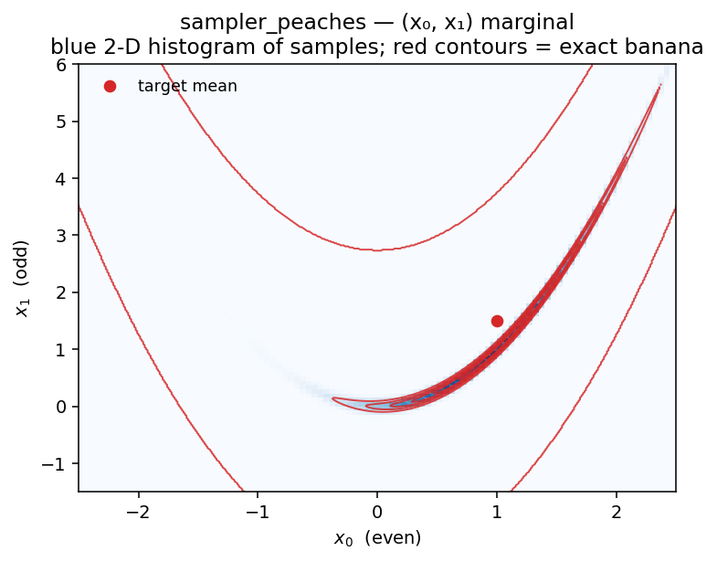
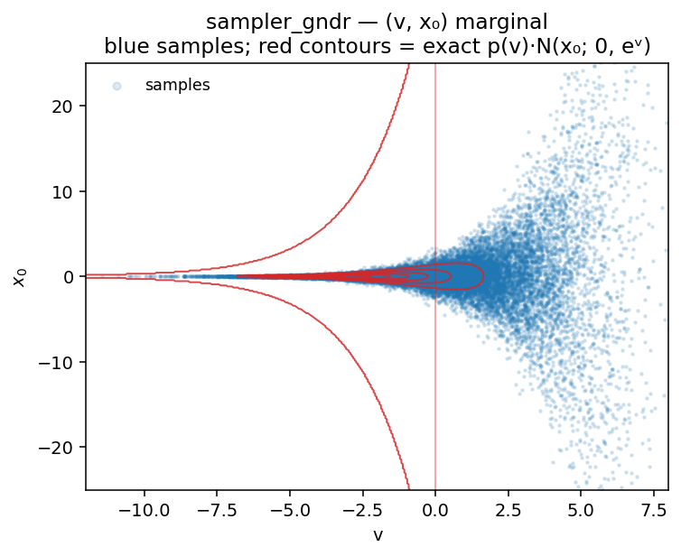

# AffineInvariantSamplers

JAX implementations of affine-invariant ensemble MCMC samplers and related
Hamiltonian Monte Carlo variants.

Paper: [**New affine invariant ensemble samplers and their dimensional
scaling**](https://arxiv.org/abs/2505.02987)

The numpy implementation that accompanied the paper lives on the
[`initial-samplers`](https://github.com/yifanc96/AffineInvariantSamplers/tree/initial-samplers)
branch.  This `main` branch is a redesigned JAX package targeting
high-dimensional, curved, and multiscale distributions, with or without
gradients of the target.

## Install

```bash
git clone https://github.com/yifanc96/AffineInvariantSamplers.git
cd AffineInvariantSamplers
pip install -e .                 # core samplers + diagnostics
pip install -e ".[plot]"         # + matplotlib (corner / trace plots)
pip install -e ".[test]"         # + pytest         (run: pytest tests/)
```

Requires Python ≥ 3.10, `jax`, `jaxlib`, `numpy`.

## Quick start

```python
import jax, jax.numpy as jnp
from affine_invariant_samplers import sampler_peaches

# 10-D Rosenbrock  (a = 1, b = 100).  Batched log density (n_chains, D) -> (n_chains,).
a, b = 1.0, 100.0
def log_prob(x):
    xe, xo = x[:, ::2], x[:, 1::2]
    return -(b * jnp.sum((xo - xe ** 2) ** 2, axis=1)
             + jnp.sum((xe - a) ** 2, axis=1))

init = jax.random.normal(jax.random.key(0), (100, 10))   # 100 walkers, D=10
samples, info = sampler_peaches(log_prob, init, num_samples=5000, warmup=1000,
                                 step_size=0.01)
```

**Output** (seed 0, with `affine_invariant_samplers.effective_sample_size`
for the last line):

```
samples.shape  = (5000, 100, 10)                            # 500 000 total samples
info           = {'acceptance_rate': 0.993,
                  'final_step_size': 0.0118,
                  'nominal_L': 20, 'mean_L': 20.0,
                  'n_grad_evals':    10_500_000}
x_even moments : mean = 0.99  var = 0.50   (target: 1.00, 0.500)
x_odd  moments : mean = 1.48  var = 2.44   (target: 1.50, 2.505)
min ESS        : 1031                                       # worst-mixing of the 10 coordinates
```

`min_ESS` is the effective sample size of the worst-mixing dimension —
the bottleneck for joint estimates.  Here ~1 000 of the 500 000 samples'
worth of information is realised in the hardest (long Rosenbrock) axis.

**Samples visualisation — 2-D marginal of (x₀, x₁)** (the canonical
Rosenbrock banana):

<p align="center">
  
</p>

Blue 2-D histogram = posterior samples; red contours = exact density
`∝ exp(−b(x₁ − x₀²)² − (x₀ − a)²)`.

**Corner plot** — first 4 dimensions (two (even, odd) Rosenbrock pairs):

<p align="center">
  
</p>

Diagonals = 1-D histograms; lower-triangular = 2-D histograms.  Red
curves / contours overlay the exact analytical marginals (`N(a, 1/2)`
for x_even, numerical quadrature for x_odd, banana for adjacent pairs,
axis-aligned products for independent pairs).

## Another example: Neal's funnel with `sampler_gndr`

Multiscale target — a Gaussian latent `v ~ N(0, 9)` and Gaussian
conditionals `x_i | v ~ N(0, exp(v))`.  The neck collapses to width
`~eᵛ/²` at `v ≪ 0`, so no single step size works everywhere.
`sampler_gndr` uses a Gauss–Newton-preconditioned proposal plus
`n_try`-stage delayed rejection (successive trial steps
`h, shrink·h, shrink²·h, …`):

```python
import jax, jax.numpy as jnp
from affine_invariant_samplers import sampler_gndr

dim = 5; d = dim - 1

def log_prob(z):                               # single-point: (D,) -> scalar
    v, xs = z[0], z[1:]
    return (-0.5 * v**2 / 9.0 - 0.5 * d * v
            - 0.5 * jnp.sum(xs**2) * jnp.exp(-v))

def residual(z):                               # for the Gauss-Newton Hessian
    v, xs = z[0], z[1:]
    return jnp.concatenate([jnp.array([v / 3.0]),
                             jnp.exp(-v / 2.0) * xs])

init = jax.random.normal(jax.random.key(99), (50, dim))
samples, info = sampler_gndr(log_prob, init, num_samples=20_000,
                              warmup=4_000, step_size=0.5, n_try=3,
                              residual_fn=residual, shrink=0.3, seed=42)
```

**Output** (seed 42):

```
samples.shape  = (20000, 50, 5)                            # 1 000 000 total samples
info           = {'acceptance_rate': 0.712,                # any of the 3 DR stages
                  'stage1_rate':     0.248,                # accepted at h directly
                  'final_step_size': 0.056,
                  'n_grad_evals':    4_000_000}
v              : mean = -0.02  var = 9.08   (target: 0, 9)
x_i (averaged) : mean = -0.01  var = 59.2   (target: 0, ≈ 90.0)
min ESS        : 2654
```

The 25 % stage-1 accept rate plus the fall-backs in stages 2 and 3 give
the overall 71 %.  `v` is recovered cleanly; `x_i` variance still
undershoots the deep-tail target — a longer run (or an ensemble method)
would close the gap.

**Samples visualisation — 2-D marginal of (v, x₀)**:

<p align="center">
  
</p>

**Corner plot** — all 5 dimensions:

<p align="center">
  
</p>

## When to use which sampler

- **Curved geometry** (Rosenbrock-like) — `sampler_peaches` first; cousins
  are `sampler_peanuts` (NUTS), `sampler_pickles` (kinetic Langevin),
  `sampler_peams` (microcanonical HMC).
- **Multiscale geometry** (funnel-like) — delayed rejection:
  `sampler_ensemble_dr_stretch` (gradient-free) or `sampler_gndr`
  (gradient + Gauss–Newton Hessian).
- **High dimension** — gradient-based ensemble HMC (same four above);
  use `sampler_kalman_move` if you have no gradient and the target is
  approximately Gaussian.

## Usage essentials

### `log_prob_fn` convention

Most samplers take a **batched** log density.  A few single-chain HMC
variants take single-point form:

| Form                                     | Samplers |
|------------------------------------------|----------|
| batched  `(n_chains, D) → (n_chains,)`   | `sampler_walk`, `sampler_stretch`, `sampler_side`, `sampler_ensemble_dr_{stretch,side}`, `sampler_langevin_walk`, `sampler_kalman_move`, `sampler_kalman_dr`, `sampler_nuts`, `sampler_peaches`, `sampler_peams`, `sampler_peanuts`, `sampler_pickles`, `sampler_chess`, `sampler_aldi`, `sampler_pickles_unadjusted` |
| single-point  `(D,) → scalar`            | `sampler_malt`, `sampler_mams`, `sampler_gndr`  |

### Gradients

Gradient-based samplers auto-differentiate `log_prob_fn` with `jax.grad`.
Pass your own via `grad_log_prob_fn=` (or `grad_fn=` for `sampler_gndr`)
if you want — shape must match `log_prob_fn`'s convention:

```python
# auto-diff (default):
samples, info = sampler_peaches(log_prob, init, num_samples=5000, warmup=1000)

# hand-written gradient:
grad_log_prob = jax.vmap(jax.grad(log_prob_single))        # batched shape
samples, info = sampler_peaches(log_prob, init, num_samples=5000, warmup=1000,
                                 grad_log_prob_fn=grad_log_prob)
```

Gradient-free samplers (`walk`, `stretch`, `side`, `ensemble_dr_*`,
`kalman_move`, `kalman_dr`) don't evaluate gradients — the Kalman moves
instead take a forward model `forward_fn` + data-space precision `M`.

### Reading the `info` dict

Most fields are self-explanatory (`acceptance_rate`, `final_step_size`, …).
Two deserve a short note:

- **`nominal_L`** / **`mean_L`** — the **target** leapfrog trajectory
  length and the **empirical mean** after per-iteration randomisation.
  Each trajectory uses a uniformly-drawn `cur_L ∈` roughly
  `[0.4·nominal_L, nominal_L]`, clipped at `max_L`.  Use `mean_L` as the
  realised cost per trajectory.  When the sampler wants such a long
  trajectory that the *low end* of the random range already exceeds
  `max_L`, every draw clips to the cap and `mean_L = nominal_L = max_L`;
  otherwise `mean_L < nominal_L`.
- **`n_grad_evals`** — exact gradient-evaluation count in the production
  phase (warmup not counted).

### Import styles

Every sampler is re-exported at the top level, so the following three
forms are **equivalent** — pick whichever reads best:

```python
# 1. flat — function imported directly
from affine_invariant_samplers import sampler_peaches

# 2. namespaced — function imported from its sub-module
from affine_invariant_samplers.peaches import sampler_peaches

# 3. module — import the sub-module and dot into it
from affine_invariant_samplers import peaches
peaches.sampler_peaches(...)
```

### Generic call signature

```
samples, info = sampler_xxx(
    log_prob_fn,                  # see convention table above
    initial_state,                # (n_chains, D)
    num_samples,
    warmup          = 1000,
    step_size       = <default>,  # ← the main knob; see note below
    seed            = 0,
    verbose         = True,
    # sampler-specific kwargs (target_accept, L, gamma, a, chees_metric, ...)
    find_init_step_size = False,  # heuristic initial step-size search (OFF by default)
    adapt_step_size     = True,   # dual averaging during warmup
    # adapt_L / adapt_gamma / adapt_a where applicable
)
```

### Picking `step_size` — the one knob that matters

**A good initial `step_size` is the single most important thing to get
right.**  Dual averaging (`adapt_step_size=True`, default) then refines
it during warmup, but it can only recover from a reasonable starting
point — if you're off by ≥10× it may not catch up, and the chain will
be biased or diverge.

Our recommendation:

1. **Start by passing your own `step_size`.**  Try a few values on a
   short run (`warmup=200, num_samples=500`) and pick one that gives
   acceptance in the 0.4–0.9 range.
2. If you don't have intuition for the scale, **set
   `find_init_step_size=True`**: a short doubling/halving search at the
   initial walker positions picks a step.  It's disabled by default
   because the heuristic can be fooled by an under-dispersed ensemble
   (initial walkers much tighter than the target) — it then latches
   onto the initial covariance and overshoots.
3. If `find_init_step_size=True` lands somewhere bad, fall back to (1)
   and supply a step yourself.

In short: **`step_size` is a user choice, not a black-box auto-pick.**
The samplers will do their best around whatever you give them.

## Samplers reference

### Ensemble affine-invariant (gradient-free)

| Function                               | Idea                                         |
|----------------------------------------|----------------------------------------------|
| `sampler_walk`                         | Goodman–Weare walk move (k-subset variant). |
| `sampler_stretch`                      | Goodman–Weare stretch move.                 |
| `sampler_side`                         | Side move (differential-evolution style).   |
| `sampler_ensemble_dr_stretch`          | 2-stage delayed-rejection stretch.          |
| `sampler_ensemble_dr_side`             | 2-stage delayed-rejection side.             |

### Ensemble gradient-based

| Function                 | Idea                                                         |
|--------------------------|--------------------------------------------------------------|
| `sampler_langevin_walk`  | Affine-invariant Langevin walk (MALA in the complement span).|
| `sampler_kalman_move`    | Ensemble Kalman move (derivative-free drift from forward G). |
| `sampler_kalman_dr`      | Multi-stage delayed-rejection Kalman move.                   |
| `sampler_gndr`           | Gauss–Newton proposal Langevin with multi-stage DR.          |

### HMC family (single chain, batched)

| Function        | Idea                                                              |
|-----------------|-------------------------------------------------------------------|
| `sampler_malt`  | Metropolis Adjusted Langevin Trajectories (BABO+O).               |
| `sampler_mams`  | Metropolis Adjusted Microcanonical Sampler (ChEES-L or τ-tuned).  |
| `sampler_nuts`  | Classical NUTS with dual averaging.                               |

### Ensemble HMC / microcanonical / NUTS

| Function           | Idea                                                                    |
|--------------------|-------------------------------------------------------------------------|
| `sampler_peaches`  | **PEACHES** — ensemble-preconditioned ChEES-tuned HMC.                  |
| `sampler_peams`    | **PEAMS**   — ensemble-preconditioned microcanonical HMC.               |
| `sampler_peanuts`  | **PEANUTS** — ensemble-preconditioned NUTS.                             |
| `sampler_pickles`  | **PICKLES** — parallel interacting covariance-preconditioned kinetic Langevin. |
| `sampler_chess`    | Standard HMC with joint dual-averaging + ChEES length tuning.           |

### Unadjusted Langevin (ensemble / interacting)

No Metropolis correction — target the continuous-time invariant
distribution; discretisation introduces bias, but often allows
larger steps than the Metropolised counterparts.

| Function                       | Idea                                                              |
|--------------------------------|-------------------------------------------------------------------|
| `sampler_aldi`                 | Affine-invariant Langevin dynamics (overdamped).                  |
| `sampler_pickles_unadjusted`   | Unadjusted PICKLES: kinetic Langevin (BAOAB) + ensemble precond.  |

### `dev/` — related methods, not in the main package

Retained for comparison and active development
(see [`dev/`](./dev/)):

- **PDMPs**: `bps.py`, `bps_walk.py`, `zigzag.py`, `zigzag_walk.py`
- **Variational inference / normalizing flows**: `gvi.py`, `gmbbvi.py`,
  `dfgmvi.py`, `ig.py`

## Diagnostics and plotting

### ESS and autocorrelation

```python
from affine_invariant_samplers import (
    effective_sample_size, integrated_autocorr_time,
)

tau  = integrated_autocorr_time(samples)   # shape (D,)  — per-dimension τ
ess  = effective_sample_size(samples)      # shape (D,)  — per-dimension ESS
```

**ESS** (effective sample size) = how many *independent* draws would
give the same Monte-Carlo variance as your correlated chain.  Reported
per-dimension; `min_ESS` is the bottleneck for joint estimates.
Accepts samples of shape `(N,)`, `(N, D)`, or `(N, n_chains, D)` (chains
averaged).

### Plotting utilities

Requires the `[plot]` extra (matplotlib).

```python
from affine_invariant_samplers.plotting import (
    corner_plot, trace_plot, autocorrelation_plot,
)

fig = corner_plot(samples, labels=["x", "y"], truths=[0.0, 0.0],
                   truth_1d={...}, truth_2d={...})
```

`corner_plot` produces a lower-triangular grid of 1-D histograms
(diagonal) and 2-D histograms (below).  Optional `truth_1d` and
`truth_2d` dicts overlay analytical marginals (red curves / contours).
Pure matplotlib — no `corner` dependency.

## Examples in `examples/`

| Script                                 | Target                              | Samplers compared                                   |
|----------------------------------------|-------------------------------------|-----------------------------------------------------|
| `example_gaussian.py`                  | 50-D anisotropic Gaussian, κ=1000   | `stretch`, `langevin_walk`, `kalman_move`, `peaches`|
| `example_rosenbrock.py`                | 10-D Rosenbrock, (a, b)=(1, 100)    | `peaches`, `pickles`, `peams`                       |
| `example_rosenbrock_unadjusted.py`     | 10-D Rosenbrock, (a, b)=(1, 100)    | `aldi`, `pickles_unadjusted`                        |
| `example_funnel.py`                    | 5-D Neal's funnel                   | `stretch`, `stretch-DR`, `gndr`                     |

```bash
python examples/example_gaussian.py
python examples/example_rosenbrock.py
python examples/example_rosenbrock_unadjusted.py
python examples/example_funnel.py
```

Each script reports mean/variance accuracy, acceptance rate, minimum
ESS, number of gradient evaluations, and wall-clock time; and displays a
contour-comparison figure plus per-method corner plots with analytical
truth overlays.

## Citation

```bibtex
@article{chen2025new,
  title={New affine invariant ensemble samplers and their dimensional scaling},
  author={Chen, Yifan},
  journal={arXiv preprint arXiv:2505.02987},
  year={2025}
}
```
